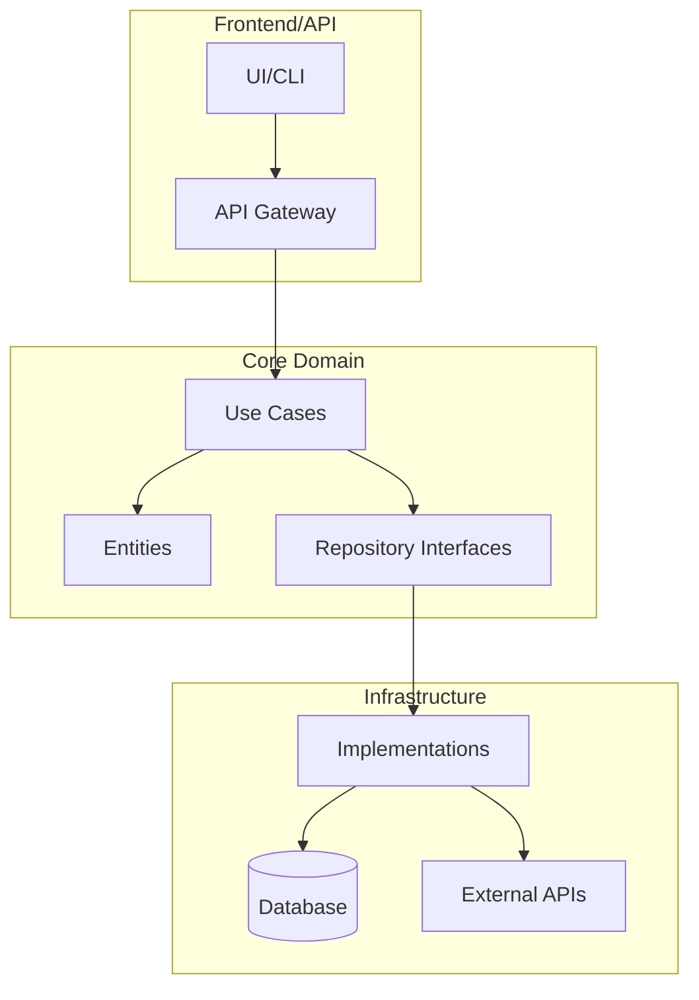
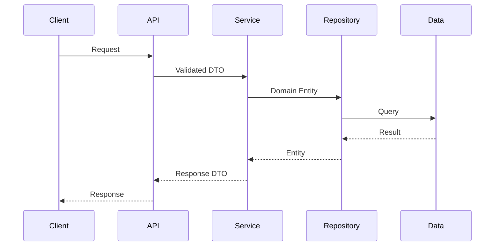

# OutboundAI - HR Tech Lead Generation System

## Descripción
Sistema avanzado de generación de leads B2B que identifica y procesa automáticamente oportunidades en tecnología HR. Utiliza IA/ML para análisis de contenido, web scraping para recopilación de datos, y automatización de correos electrónicos para alcance personalizado. El sistema procesa señales de seis tipos diferentes para identificar empresas evaluando soluciones HR, liderazgo nuevo, cambios tecnológicos y más.

## Stack Tecnológico
- **Python 3.8+** - Lenguaje principal
- **LangChain & Ollama** - Procesamiento de IA y análisis LLM (llama3.1:8b)
- **BeautifulSoup4** - Web scraping y análisis de contenido
- **Pandas** - Procesamiento y análisis de datos
- **Google APIs** - Integración con Gmail y Google Sheets
- **NewsData.io API** - Agregación de noticias
- **SQLModel/SQLAlchemy** - ORM y gestión de base de datos
- **Async/aiohttp** - Procesamiento concurrente de URLs
- **Pytest** - Testing (cobertura >80%)
- **Streamlit/Plotly** - Visualización de datos

## Estructura Principal
- **`outbound.py`** - Motor principal de orquestación y procesamiento
- **`weekly_scheduler.py`** - Automatización de ejecuciones semanales
- **`gmail_email_system.py`** - Servicio de generación y envío de correos personalizados
- **`src/llm_service.py`** - Servicio de IA para análisis de contenido
- **`src/search_service.py`** - Recuperación de artículos de noticias
- **`src/scraping_service.py`** - Extracción de contenido web
- **`src/signal_processor.py`** - Procesamiento de los 6 tipos de señales
- **`src/performance_optimizer.py`** - Procesamiento asincrónico y caché
- **`src/credentials_manager.py`** - Gestión segura de credenciales
- **`config/`** - Archivos de configuración (YAML)
- **`tests/`** - Suite de tests comprensiva
- **`scripts/`** - Scripts de utilidad y automación

## Comandos Útiles
```bash
# Instalación
pip install -r requirements.txt
cp env.example .env
# Editar .env con credenciales necesarias

# Ejecución manual
python outbound.py                    # Test de una señal
WEEKLY_RUN=true python outbound.py   # Ejecución completa (todas las señales)

# Scheduler automatizado
python weekly_scheduler.py            # Inicia scheduler semanal
pkill -f weekly_scheduler.py          # Detiene scheduler

# Email
python gmail_email_system.py          # Test del sistema de email

# Testing
pytest tests/ -v --cov=src           # Ejecutar tests con cobertura
pytest tests/test_outbound.py -v     # Tests específicos
pytest tests/test_llm_service.py -v  # Tests del servicio LLM

# Code quality
black src/ tests/                     # Formatear código
flake8 src/ tests/                    # Linting
mypy src/                             # Type checking
bandit -r src/                        # Análisis de seguridad
```

---

# CLAUDE.md - Vibe Code Rules v2.0

> **Archivo maestro de reglas para IA en proyectos de software**
> Copiar a la raíz de cada proyecto como `CLAUDE.md`

---

## Arquitectura del Proyecto





---

## AI Thinking Rules

### Antes de escribir codigo SIEMPRE preguntate:

```yaml
reflexion_obligatoria:
  - "Este codigo se parece a otra parte del proyecto?"
  - "Puedo extraer esto en una funcion reutilizable?"
  - "Estoy creando una dependencia circular?"
  - "Este archivo va a superar 300 lineas?"
  - "Esta funcion va a superar 30 lineas?"
  - "El nombre explica claramente que hace?"
  - "Estoy hardcodeando algo que deberia ser config?"
```

### Principios Core

```yaml
codigo:
  max_file_lines: 300
  max_function_lines: 30
  max_class_methods: 10
  max_parameters: 5

naming:
  functions: snake_case
  classes: PascalCase
  constants: UPPER_SNAKE_CASE
  private: _prefixed

principios:
  - "Cada funcion debe hacer UNA cosa"
  - "Preferir composicion sobre herencia"
  - "Fail fast - validar inputs temprano"
  - "No premature optimization"
  - "DRY pero no obsesivo - 3 repeticiones = refactor"
```

---

## CTO Rules - Se activan cuando codigo crece 2x

Cuando el proyecto crece significativamente, verificar:

### Checklist Obligatorio

```markdown
## Documentacion
- [ ] README.md actualizado
- [ ] Diagramas de arquitectura al dia
- [ ] CHANGELOG.md con cambios recientes

## Testing
- [ ] Tests para nuevos modulos
- [ ] Cobertura > 70%

## Arquitectura
- [ ] Sin dependencias circulares
- [ ] Archivos < 300 lineas
- [ ] Funciones < 30 lineas
- [ ] Codigo duplicado identificado y extraido

## Seguridad
- [ ] Sin secrets hardcodeados
- [ ] Variables de entorno para configs sensibles
- [ ] Input validation en boundaries
```

---

## AI Commands - Aliases Rapidos

Agregar a `~/.zshrc` o `~/.bashrc`:

```bash
# === ANALISIS ===
alias ai-review='bash scripts/ai-review.sh'
alias ai-cto='bash scripts/cto-check.sh'
alias ai-extract='bash scripts/ai-extract.sh'
alias ai-tree='tree -I "node_modules|.venv|__pycache__|.git|env" -L 3'

# === METRICAS ===
alias ai-loc='find . -name "*.py" -o -name "*.js" -o -name "*.ts" | xargs wc -l | tail -1'
alias ai-big='find . \( -name "*.py" -o -name "*.js" -o -name "*.ts" \) ! -path "*/node_modules/*" -exec wc -l {} \; | sort -rn | head -10'
alias ai-todos='grep -rn "TODO\|FIXME\|HACK" --include="*.py" --include="*.js" --include="*.ts" . | head -20'

# === DEPENDENCIAS CIRCULARES ===
alias ai-circular='python3 -c "
import ast, os
from collections import defaultdict
imports = defaultdict(set)
for root, dirs, files in os.walk(\".\"):
    dirs[:] = [d for d in dirs if d not in [\"node_modules\", \".venv\", \"__pycache__\", \".git\"]]
    for f in files:
        if f.endswith(\".py\"):
            try:
                with open(os.path.join(root, f)) as file:
                    tree = ast.parse(file.read())
                    module = os.path.join(root, f).replace(\"/\", \".\").replace(\".py\", \"\").lstrip(\".\")
                    for node in ast.walk(tree):
                        if isinstance(node, ast.ImportFrom) and node.module:
                            imports[module].add(node.module)
            except: pass
for mod, deps in imports.items():
    for dep in deps:
        if dep in imports and mod in imports[dep]:
            print(f\"CIRCULAR: {mod} <-> {dep}\")
"'

# === GIT HELPERS ===
alias ai-precommit='ai-review && echo "Ready for commit"'
alias ai-prepush='ai-cto && echo "Ready for push"'
```

---

## Custom Scripts - Crear en `scripts/`

### scripts/ai-review.sh
```bash
#!/bin/bash
# Quality Gates automatizados

echo "=== AI CODE REVIEW ==="

# 1. Sintaxis
echo "[1/5] Checking syntax..."
find . -name "*.py" ! -path "*/.venv/*" -exec python -m py_compile {} \; 2>&1 | head -5

# 2. Dependencias circulares
echo "[2/5] Checking circular deps..."
python3 -c "
import ast, os
from collections import defaultdict
imports = defaultdict(set)
for root, dirs, files in os.walk('.'):
    dirs[:] = [d for d in dirs if d not in ['node_modules', '.venv', '__pycache__', '.git']]
    for f in files:
        if f.endswith('.py'):
            try:
                with open(os.path.join(root, f)) as file:
                    tree = ast.parse(file.read())
                    module = os.path.join(root, f).replace('/', '.').replace('.py', '').lstrip('.')
                    for node in ast.walk(tree):
                        if isinstance(node, ast.ImportFrom) and node.module:
                            imports[module].add(node.module)
            except: pass
found = False
for mod, deps in imports.items():
    for dep in deps:
        if dep in imports and mod in imports[dep]:
            print(f'  CIRCULAR: {mod} <-> {dep}')
            found = True
if not found: print('  OK - No circular dependencies')
"

# 3. Archivos grandes
echo "[3/5] Checking file sizes..."
find . -name "*.py" ! -path "*/.venv/*" -exec wc -l {} \; | while read lines file; do
    if [ "$lines" -gt 300 ]; then echo "  WARNING: $file = $lines lines"; fi
done

# 4. Funciones largas
echo "[4/5] Checking function sizes..."
python3 -c "
import ast, os
for root, dirs, files in os.walk('.'):
    dirs[:] = [d for d in dirs if d not in ['node_modules', '.venv', '__pycache__', '.git']]
    for f in files:
        if f.endswith('.py'):
            try:
                with open(os.path.join(root, f)) as file:
                    tree = ast.parse(file.read())
                    for node in ast.walk(tree):
                        if isinstance(node, (ast.FunctionDef, ast.AsyncFunctionDef)):
                            if hasattr(node, 'end_lineno'):
                                lines = node.end_lineno - node.lineno
                                if lines > 30:
                                    print(f'  WARNING: {os.path.join(root,f)}:{node.lineno} {node.name}() = {lines} lines')
            except: pass
"

# 5. TODOs
echo "[5/5] Pending TODOs..."
grep -rn "TODO\|FIXME" --include="*.py" . 2>/dev/null | head -5 || echo "  None"

echo "=== Review Complete ==="
```

### scripts/cto-check.sh
```bash
#!/bin/bash
# CTO Rules Verification

echo "=== CTO RULES CHECK ==="
score=0

# README
if [ -f "README.md" ] && [ $(wc -l < README.md) -gt 30 ]; then
    echo "[OK] README.md"; ((score++))
else
    echo "[FAIL] README.md missing or too short"
fi

# Tests
tests=$(find . -name "test_*.py" 2>/dev/null | wc -l)
if [ "$tests" -ge 3 ]; then
    echo "[OK] Tests: $tests files"; ((score++))
else
    echo "[WARN] Only $tests test files"
fi

# File sizes
big=$(find . -name "*.py" ! -path "*/.venv/*" -exec wc -l {} \; | awk '$1>300{c++}END{print c+0}')
if [ "$big" -eq 0 ]; then
    echo "[OK] All files < 300 lines"; ((score++))
else
    echo "[WARN] $big files > 300 lines"
fi

# Secrets
secrets=$(grep -rn "password\s*=\s*['\"][^'\"]\+" --include="*.py" . 2>/dev/null | wc -l)
if [ "$secrets" -eq 0 ]; then
    echo "[OK] No hardcoded secrets"; ((score++))
else
    echo "[FAIL] $secrets possible secrets found"
fi

# Logging
if grep -rq "import logging" --include="*.py" . 2>/dev/null; then
    echo "[OK] Logging configured"; ((score++))
else
    echo "[WARN] No logging found"
fi

echo "=== Score: $score/5 ==="
```

---

## Git Hooks - Stop Hooks para Quality

### .git/hooks/pre-commit
```bash
#!/bin/bash
echo "Running pre-commit checks..."

STAGED=$(git diff --cached --name-only --diff-filter=ACM | grep "\.py$" || true)
[ -z "$STAGED" ] && exit 0

errors=0

# Syntax check
for file in $STAGED; do
    python -m py_compile "$file" 2>&1 || ((errors++))
done

# File size check
for file in $STAGED; do
    [ -f "$file" ] && lines=$(wc -l < "$file")
    [ "$lines" -gt 400 ] && echo "ERROR: $file too large ($lines lines)" && ((errors++))
done

# Secret check
for file in $STAGED; do
    grep -q "password\s*=\s*['\"][^'\"]\+" "$file" && echo "ERROR: Possible secret in $file" && ((errors++))
done

[ $errors -gt 0 ] && exit 1
echo "Pre-commit OK"
```

### .git/hooks/pre-push
```bash
#!/bin/bash
echo "Running pre-push CTO checks..."

BASELINE_FILE=".cto_baseline"
CURRENT=$(find . -name "*.py" ! -path "*/.venv/*" -exec cat {} \; 2>/dev/null | wc -l)

if [ -f "$BASELINE_FILE" ]; then
    BASELINE=$(cat "$BASELINE_FILE")
    [ "$BASELINE" -eq 0 ] && BASELINE=1
    RATIO=$(echo "scale=2; $CURRENT / $BASELINE" | bc)

    if (( $(echo "$RATIO >= 2.0" | bc -l) )); then
        echo ""
        echo "=== CTO RULES ACTIVATED (Code grew ${RATIO}x) ==="
        echo "Run: bash scripts/cto-check.sh"
        echo ""
        read -p "Confirm checklist complete? (y/N): " confirm
        [ "$confirm" != "y" ] && exit 1
        echo "$CURRENT" > "$BASELINE_FILE"
    fi
else
    echo "$CURRENT" > "$BASELINE_FILE"
fi

echo "Pre-push OK"
```

---

## Anti-Patterns a Detectar

### Codigo Duplicado
```python
# MAL - Logica repetida
def validate_user_email(email):
    if "@" not in email: raise ValueError("Invalid")

def validate_admin_email(email):
    if "@" not in email: raise ValueError("Invalid")  # DUPLICADO!

# BIEN - Extraer funcion comun
def validate_email(email: str) -> None:
    if "@" not in email: raise ValueError("Invalid")
```

### Dependencias Circulares
```python
# MAL
# module_a.py
from module_b import func_b
# module_b.py
from module_a import func_a  # CIRCULAR!

# BIEN - Usar interfaces/DI
# interfaces.py
class ServiceInterface(ABC): ...
# module_a.py
from interfaces import ServiceInterface
```

### Archivos Gigantes
```python
# MAL - Un archivo con todo
# services.py (800 lineas)

# BIEN - Separar por responsabilidad
# services/user_service.py (<150 lineas)
# services/order_service.py (<150 lineas)
```

---

## Quick Start

```bash
# Al iniciar trabajo en proyecto:
1. Leer CLAUDE.md
2. Ejecutar: bash scripts/ai-review.sh
3. Revisar dependencias circulares
4. Verificar archivos > 300 lineas

# Antes de commit:
bash scripts/ai-review.sh

# Antes de push (si cambios grandes):
bash scripts/cto-check.sh
```

---

**Version**: 2.0.0
**Ultima actualizacion**: 2025-01-30
