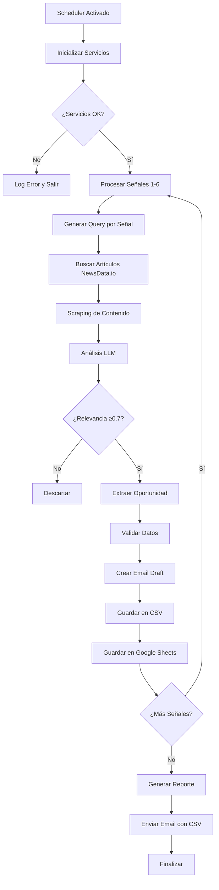
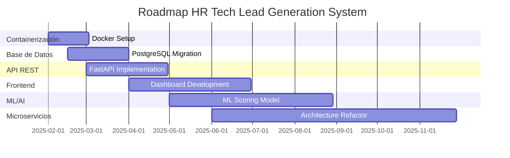

# HR Tech Lead Generation System - Requirements Documentation

## Tabla de Contenidos

1. [Visión General del Proyecto](#visión-general-del-proyecto)
2. [Estructura de Carpetas y Archivos](#estructura-de-carpetas-y-archivos)
3. [Backend](#backend)
4. [Data Streams y Procesamiento en Tiempo Real](#data-streams-y-procesamiento-en-tiempo-real)
5. [Frontend](#frontend)
6. [Base de Datos](#base-de-datos)
7. [Infraestructura y Despliegue](#infraestructura-y-despliegue)
8. [Cómo Ejecutar el Proyecto Localmente](#cómo-ejecutar-el-proyecto-localmente)
9. [Próximos Pasos / Roadmap](#próximos-pasos--roadmap)

---

## 1. Visión General del Proyecto

### 1.1 Objetivo del Proyecto

El **HR Tech Lead Generation System** es un sistema avanzado de generación automática de leads B2B que identifica y procesa oportunidades en el sector de tecnología de recursos humanos (HR Tech). El sistema utiliza inteligencia artificial y aprendizaje automático para análisis de contenido, web scraping para recolección de datos, y automatización de emails para outreach personalizado.

**Objetivos principales:**
- Generar automáticamente 50+ oportunidades de alta calidad por semana
- Identificar empresas que están evaluando, implementando o cambiando soluciones de HR Tech
- Crear emails personalizados profesionales para cada lead
- Ejecutar procesos automatizados de forma semanal sin intervención manual
- Mantener un score de relevancia mínimo de 0.7 para todas las oportunidades

### 1.2 Tecnologías Utilizadas

#### Stack Backend

| Categoría | Tecnología | Versión | Propósito |
|-----------|-----------|---------|-----------|
| **Lenguaje** | Python | 3.8+ | Lenguaje principal del sistema |
| **Framework** | Sin framework específico | - | Arquitectura modular con servicios independientes |
| **LLM/AI** | Ollama (llama3.1:8b) | latest | Análisis inteligente de contenido y extracción de oportunidades |
| **LLM Framework** | LangChain | 0.3.0+ | Integración con modelos LLM |
| **HTTP Client** | Requests | 2.28.0+ | Cliente HTTP síncrono |
| **Async HTTP** | aiohttp | - | Scraping asíncrono de alto rendimiento |
| **Web Scraping** | BeautifulSoup4 | 4.11.0+ | Parsing de HTML |
| **Data Processing** | Pandas | 1.5.0+ | Manipulación y exportación de datos |
| **Configuration** | PyYAML | 6.0+ | Gestión de configuración YAML |
| **Environment** | python-dotenv | 0.19.0+ | Variables de entorno |
| **Scheduling** | schedule | - | Programación de tareas |
| **Date Handling** | python-dateutil | 2.8.0+ | Manejo de fechas |
| **Rate Limiting** | ratelimit | 2.2.0+ | Control de límites de API |

#### Integraciones Externas

| Servicio | API | Propósito |
|----------|-----|-----------|
| **NewsData.io** | REST API | Búsqueda de artículos de noticias |
| **SerpAPI** | REST API | Búsqueda avanzada en Google |
| **Hunter.io** | REST API | Verificación de emails |
| **Gmail API** | REST API | Creación de drafts de emails |
| **Google Sheets API** | REST API | Almacenamiento y tracking de leads |
| **Apify** | REST API | Web scraping avanzado |
| **Ollama** | Local API | Servicio LLM local |

#### Herramientas de Desarrollo

| Herramienta | Versión | Propósito |
|-------------|---------|-----------|
| **pytest** | 7.0.0+ | Framework de testing |
| **pytest-cov** | 4.0.0+ | Cobertura de código |
| **black** | 22.0.0+ | Formateo de código |
| **flake8** | 5.0.0+ | Linting |
| **mypy** | 0.991+ | Type checking |
| **bandit** | 1.7.0+ | Security scanning |
| **safety** | 2.0.0+ | Vulnerability scanning |

### 1.3 Arquitectura General

```
┌─────────────────────────────────────────────────────────────────────┐
│              HR Tech Lead Generation System                         │
├─────────────────────────────────────────────────────────────────────┤
│                                                                      │
│  ┌──────────────────────────────────────────────────────────────┐  │
│  │                    Orchestration Layer                        │  │
│  │  ┌──────────────┐  ┌──────────────┐  ┌──────────────┐      │  │
│  │  │   Scheduler  │  │ Main Engine  │  │ Email System  │      │  │
│  │  │   Service    │  │ (outbound.py)│  │  (Gmail API)  │      │  │
│  │  └──────────────┘  └──────────────┘  └──────────────┘      │  │
│  └──────────────────────────────────────────────────────────────┘  │
│                           │                                         │
│  ┌──────────────────────────────────────────────────────────────┐  │
│  │                    Core Services Layer                       │  │
│  │  ┌──────────────┐  ┌──────────────┐  ┌──────────────┐      │  │
│  │  │    LLM       │  │   Search     │  │   Scraping    │      │  │
│  │  │   Service    │  │   Service    │  │   Service     │      │  │
│  │  └──────────────┘  └──────────────┘  └──────────────┘      │  │
│  │  ┌──────────────┐  ┌──────────────┐  ┌──────────────┐      │  │
│  │  │  Signal      │  │ Performance  │  │  Credentials  │      │  │
│  │  │  Processor   │  │  Optimizer   │  │   Manager     │      │  │
│  │  └──────────────┘  └──────────────┘  └──────────────┘      │  │
│  │  ┌──────────────┐  ┌──────────────┐                        │  │
│  │  │   Google     │  │  Validators  │                        │  │
│  │  │   Sheets     │  │   & Parsers  │                        │  │
│  │  └──────────────┘  └──────────────┘                        │  │
│  └──────────────────────────────────────────────────────────────┘  │
│                           │                                         │
│  ┌──────────────────────────────────────────────────────────────┐  │
│  │                    External Services                          │  │
│  │  ┌──────────────┐  ┌──────────────┐  ┌──────────────┐      │  │
│  │  │ NewsData.io  │  │  Hunter.io   │  │   SerpAPI    │      │  │
│  │  └──────────────┘  └──────────────┘  └──────────────┘      │  │
│  │  ┌──────────────┐  ┌──────────────┐  ┌──────────────┐      │  │
│  │  │   Ollama     │  │ Google APIs   │  │    Apify     │      │  │
│  │  │   (Local)    │  │ (Gmail/Sheets)│  │              │      │  │
│  │  └──────────────┘  └──────────────┘  └──────────────┘      │  │
│  └──────────────────────────────────────────────────────────────┘  │
│                           │                                         │
│  ┌──────────────────────────────────────────────────────────────┐  │
│  │                    Data Storage Layer                        │  │
│  │  ┌──────────────┐  ┌──────────────┐  ┌──────────────┐      │  │
│  │  │  CSV Files   │  │ Google Sheets│  │  JSON Files   │      │  │
│  │  │  (Leads)     │  │  (Tracking)   │  │  (Config)     │      │  │
│  │  └──────────────┘  └──────────────┘  └──────────────┘      │  │
│  │  ┌──────────────┐  ┌──────────────┐                        │  │
│  │  │  Log Files   │  │   Cache      │                        │  │
│  │  │  (System)    │  │  (Memory)    │                        │  │
│  │  └──────────────┘  └──────────────┘                        │  │
│  └──────────────────────────────────────────────────────────────┘  │
└─────────────────────────────────────────────────────────────────────┘
```

#### Diagrama de Flujo de Procesamiento



---

## 2. Estructura de Carpetas y Archivos

### 2.1 Árbol de Directorios Completo

```
outboundai/
├── __pycache__/                    # Bytecode de Python (generado)
├── config/                          # Configuración del sistema
│   ├── email_templates.yaml         # Plantillas de emails por tipo de señal
│   └── secure_config.yaml           # Configuración no sensible
├── htmlcov/                         # Reportes de cobertura HTML (generado)
├── node_modules/                    # Dependencias Node.js (si aplica)
├── scripts/                         # Scripts auxiliares
│   ├── deploy_secure.py            # Script de despliegue seguro
│   ├── find_contacts.py             # Script para encontrar contactos
│   ├── lint_and_test.py            # Script de linting y testing
│   ├── research_contacts.py         # Script de investigación de contactos
│   └── run_tests.py                 # Ejecutor de tests
├── src/                             # Código fuente principal
│   ├── __pycache__/                # Bytecode (generado)
│   ├── constants.py                # Constantes del sistema
│   ├── credentials_manager.py      # Gestión segura de credenciales
│   ├── exceptions.py               # Excepciones personalizadas
│   ├── google_sheets_service.py    # Servicio de Google Sheets
│   ├── llm_service.py              # Servicio LLM con retry y fallback
│   ├── models.py                   # Modelos de datos (Opportunity, Article, etc.)
│   ├── parsers.py                  # Parsers de contenido
│   ├── performance_optimizer.py     # Optimizador de rendimiento
│   ├── scraping_service.py         # Servicio de web scraping
│   ├── search_service.py           # Servicio de búsqueda de noticias
│   ├── signal_processor.py         # Procesador de señales
│   ├── validators.py               # Validadores de datos
│   ├── integrations/                # Integraciones externas
│   │   ├── __init__.py
│   │   └── newsdata_client.py      # Cliente de NewsData.io
│   └── workflows/                   # Flujos de trabajo
│       ├── __init__.py
│       └── lead_generator.py       # Generador principal de leads
├── tests/                           # Tests unitarios e integración
│   ├── __pycache__/                # Bytecode (generado)
│   ├── test_credentials_manager.py # Tests de gestión de credenciales
│   ├── test_email_system.py        # Tests del sistema de email
│   ├── test_integration.py         # Tests de integración
│   ├── test_llm_service.py         # Tests del servicio LLM
│   ├── test_outbound.py            # Tests del motor principal
│   ├── test_real_workflow.py       # Tests de flujo real
│   ├── test_scraping_workflow.py   # Tests de scraping
│   ├── test_validators.py          # Tests de validadores
│   └── test_weekly_scheduler.py    # Tests del scheduler
├── venv/                            # Entorno virtual Python (no versionado)
├── .env                             # Variables de entorno (no versionado)
├── .pre-commit-config.yaml          # Configuración de pre-commit hooks
├── all_signals*.csv                 # Archivos CSV de leads generados
├── app_run_latest.log               # Log más reciente de ejecución
├── ARCHITECTURE.md                  # Documentación de arquitectura
├── coverage.xml                     # Reporte de cobertura XML
├── daily_scheduler_error.log        # Logs de errores del scheduler diario
├── daily_scheduler.log              # Logs del scheduler diario
├── email_drafts_summary.json        # Resumen de drafts de email creados
├── env.example                      # Ejemplo de archivo de variables de entorno
├── gmail_credentials.json           # Credenciales OAuth de Gmail (no versionado)
├── gmail_email_system.log           # Logs del sistema de email
├── gmail_email_system.py            # Sistema de email con Gmail API
├── gmail_setup_instructions.md      # Instrucciones de configuración de Gmail
├── gmail_token.json                 # Token OAuth de Gmail (no versionado)
├── GOOGLE_SHEETS_INTEGRATION.md     # Documentación de integración Google Sheets
├── mypy.ini                          # Configuración de MyPy
├── opportunities_tracking.json      # Tracking de oportunidades procesadas
├── outbound.py                      # Motor principal del sistema
├── outbound_backup.py               # Backup del motor principal
├── production_config.json            # Configuración de producción
├── pyproject.toml                    # Configuración del proyecto Python
├── README.md                         # README principal
├── README_SECURE_DEPLOYMENT.md      # Guía de despliegue seguro
├── README_WEEKLY_SYSTEM.md          # Documentación del sistema semanal
├── requirements.txt                 # Dependencias Python
├── scrape.log                       # Log principal del sistema
├── send_historical_leads.py         # Script para enviar leads históricos
├── setup_daily_scheduler.sh         # Script de configuración del scheduler diario
├── setup_google_sheets.py           # Script de configuración de Google Sheets
├── start_daily_scheduler.py         # Iniciador del scheduler diario
├── start_weekly_scheduler.sh        # Script de inicio del scheduler semanal
├── stop_email_spam.py               # Script para detener spam de emails
├── synthesized_report.md            # Reporte sintetizado generado
├── SYSTEM_SUMMARY.md                # Resumen del sistema
├── test_credentials.json            # Credenciales de prueba
├── test_email_format.py             # Test de formato de email
├── test_gmail_integration.py        # Test de integración Gmail
├── test_google_sheets.py            # Test de Google Sheets
├── test.json                        # Archivo JSON de prueba
├── test.py                          # Script de prueba
├── test_run*.log                    # Logs de ejecuciones de prueba
├── TEST_RESULTS.md                  # Resultados de tests
├── weekly_scheduler.lock            # Lock file del scheduler semanal
├── weekly_scheduler.log              # Logs del scheduler semanal
└── weekly_scheduler.py              # Scheduler semanal automatizado
```

### 2.2 Descripción de Carpetas y Archivos Principales

#### Carpeta `src/` - Código Fuente Principal

| Archivo | Propósito | Responsabilidades |
|---------|-----------|-------------------|
| `constants.py` | Constantes del sistema | Define todas las constantes: URLs de API, límites, umbrales de calidad, tipos de señales, configuraciones de scheduler |
| `credentials_manager.py` | Gestión de credenciales | Carga y valida credenciales desde variables de entorno, gestiona configuración YAML, maneja errores de autenticación |
| `exceptions.py` | Excepciones personalizadas | Define excepciones específicas del dominio: `APIServiceError`, `AuthenticationError`, `NetworkError`, `RateLimitError`, `ScrapingError`, `ValidationError` |
| `google_sheets_service.py` | Servicio Google Sheets | CRUD completo para leads en Google Sheets, tracking de estado, generación de estadísticas |
| `llm_service.py` | Servicio LLM | Integración con Ollama, retry con exponential backoff, fallback responses, queue management, health monitoring |
| `models.py` | Modelos de datos | Define `Opportunity`, `Article`, `EmailDraft`, `SearchQuery` con validación, métodos `to_dict()` y `from_dict()` |
| `parsers.py` | Parsers de contenido | Extracción de información estructurada de contenido HTML/texto, parsing de fechas, nombres, emails |
| `performance_optimizer.py` | Optimizador de rendimiento | Scraping asíncrono con aiohttp, caching con TTL, connection pooling, batch processing |
| `scraping_service.py` | Servicio de scraping | Scraping web con respeto a robots.txt, retry mechanisms, extracción de texto HTML, manejo de errores |
| `search_service.py` | Servicio de búsqueda | Integración con NewsData.io y SerpAPI, rate limiting, paginación, filtrado por dominio |
| `signal_processor.py` | Procesador de señales | Generación de queries por tipo de señal, procesamiento de contenido, scoring de relevancia, extracción de oportunidades |
| `validators.py` | Validadores | Validación de emails, URLs, datos de oportunidades, scores de relevancia, tipos de señales |

#### Carpeta `src/workflows/` - Flujos de Trabajo

| Archivo | Propósito | Responsabilidades |
|---------|-----------|-------------------|
| `lead_generator.py` | Generador de leads | Orquestación del proceso de generación, procesamiento de múltiples señales, agregación de resultados, estadísticas de procesamiento |

#### Carpeta `src/integrations/` - Integraciones Externas

| Archivo | Propósito | Responsabilidades |
|---------|-----------|-------------------|
| `newsdata_client.py` | Cliente NewsData.io | Wrapper para API de NewsData.io, manejo de paginación, filtrado de resultados |

#### Archivos Raíz Principales

| Archivo | Propósito | Responsabilidades |
|---------|-----------|-------------------|
| `outbound.py` | Motor principal | Orquestación central, inicialización de servicios, procesamiento de señales, exportación CSV, envío de emails |
| `weekly_scheduler.py` | Scheduler semanal | Programación automática (domingo 8 PM EST), backup runs, tracking de performance, reportes por email |
| `gmail_email_system.py` | Sistema de email | Integración Gmail API, creación de drafts personalizados, gestión de templates, autenticación OAuth |

#### Carpeta `config/` - Configuración

| Archivo | Propósito | Contenido |
|---------|-----------|-----------|
| `email_templates.yaml` | Plantillas de email | Templates personalizados para cada tipo de señal (1-6), configuración de email (sender, company, etc.) |
| `secure_config.yaml` | Configuración segura | Configuración no sensible: timeouts, retries, umbrales de calidad, fuentes de noticias, keywords |

#### Carpeta `tests/` - Tests

| Archivo | Propósito | Cobertura |
|---------|-----------|-----------|
| `test_outbound.py` | Tests del motor principal | Flujos completos, inicialización de servicios, procesamiento de señales |
| `test_llm_service.py` | Tests del servicio LLM | Retry logic, fallback responses, queue management |
| `test_credentials_manager.py` | Tests de credenciales | Carga de variables de entorno, validación, manejo de errores |
| `test_email_system.py` | Tests del sistema de email | Creación de drafts, templates, autenticación Gmail |
| `test_integration.py` | Tests de integración | Flujos end-to-end, integraciones con APIs externas |
| `test_weekly_scheduler.py` | Tests del scheduler | Programación, ejecución, tracking, reportes |

---

## 3. Backend

### 3.1 Framework y Versión

El proyecto **no utiliza un framework web tradicional** (como Django, Flask, FastAPI). Es un sistema de procesamiento de datos con arquitectura modular basada en servicios independientes.

- **Lenguaje**: Python 3.8+
- **Arquitectura**: Modular con servicios independientes
- **Paradigma**: Programación orientada a objetos con funciones asíncronas donde aplica

### 3.2 Endpoints API Internos

El sistema **no expone endpoints HTTP REST**. Es un sistema de procesamiento por lotes que se ejecuta de forma programada. Sin embargo, consume múltiples APIs externas:

#### 3.2.1 NewsData.io API

| Método | Endpoint | Descripción | Parámetros |
|--------|----------|-------------|------------|
| GET | `https://newsdata.io/api/1/latest` | Obtener artículos de noticias recientes | `apikey` (query), `q` (query), `language` (query), `category` (query), `country` (query), `domain` (query), `page` (query) |

**Ejemplo de Request:**
```json
GET /api/1/latest?apikey=YOUR_API_KEY&q=HR+tech+evaluation&language=en&category=technology&page=1
```

**Ejemplo de Response 200:**
```json
{
  "status": "success",
  "totalResults": 150,
  "results": [
    {
      "article_id": "abc123",
      "title": "Company X Evaluates New HR Technology",
      "link": "https://example.com/article",
      "keywords": ["HR", "technology"],
      "creator": ["John Doe"],
      "description": "Company X is evaluating new HR technology solutions...",
      "content": "Full article content...",
      "pubDate": "2025-01-15 10:00:00",
      "source_id": "example",
      "source_name": "Example News",
      "category": ["technology"],
      "country": ["us"]
    }
  ],
  "nextPage": "abc123def456"
}
```

**Errores Comunes:**
- `401 Unauthorized`: API key inválida o faltante
- `429 Too Many Requests`: Límite de rate limit excedido
- `500 Internal Server Error`: Error del servidor de NewsData.io

#### 3.2.2 Gmail API

| Método | Endpoint | Descripción | Parámetros |
|--------|----------|-------------|------------|
| POST | `https://gmail.googleapis.com/gmail/v1/users/me/drafts` | Crear draft de email | Body: `message` (objeto MIME codificado en base64) |

**Ejemplo de Request:**
```json
POST /gmail/v1/users/me/drafts
Authorization: Bearer YOUR_ACCESS_TOKEN
Content-Type: application/json

{
  "message": {
    "raw": "base64_encoded_mime_message"
  }
}
```

**Ejemplo de Response 200:**
```json
{
  "id": "draft123",
  "message": {
    "id": "msg123",
    "threadId": "thread123",
    "labelIds": ["DRAFT"]
  }
}
```

**Errores Comunes:**
- `401 Unauthorized`: Token OAuth inválido o expirado
- `403 Forbidden`: Scope insuficiente o cuenta sin permisos
- `400 Bad Request`: Formato de mensaje inválido

#### 3.2.3 Google Sheets API

| Método | Endpoint | Descripción | Parámetros |
|--------|----------|-------------|------------|
| POST | `https://sheets.googleapis.com/v4/spreadsheets/{spreadsheetId}/values/{range}:append` | Agregar fila a hoja | `spreadsheetId` (path), `range` (path), `values` (body) |
| GET | `https://sheets.googleapis.com/v4/spreadsheets/{spreadsheetId}/values/{range}` | Leer datos de hoja | `spreadsheetId` (path), `range` (path) |

**Ejemplo de Request (Append):**
```json
POST /v4/spreadsheets/SPREADSHEET_ID/values/Sheet1!A1:append?valueInputOption=RAW
Authorization: Bearer YOUR_ACCESS_TOKEN
Content-Type: application/json

{
  "values": [
    [
      "2025-01-15",
      "Company X",
      "John Doe",
      "john@companyx.com",
      "CHRO",
      "0.85",
      "1",
      "https://example.com/article",
      "new",
      "High-quality lead"
    ]
  ]
}
```

**Ejemplo de Response 200:**
```json
{
  "spreadsheetId": "SPREADSHEET_ID",
  "tableRange": "Sheet1!A1:J1",
  "updates": {
    "spreadsheetId": "SPREADSHEET_ID",
    "updatedRange": "Sheet1!A10:J10",
    "updatedRows": 1,
    "updatedColumns": 10,
    "updatedCells": 10
  }
}
```

#### 3.2.4 Hunter.io API

| Método | Endpoint | Descripción | Parámetros |
|--------|----------|-------------|------------|
| GET | `https://api.hunter.io/v2/email-verifier` | Verificar email | `email` (query), `api_key` (query) |

**Ejemplo de Request:**
```
GET /v2/email-verifier?email=john@companyx.com&api_key=YOUR_API_KEY
```

**Ejemplo de Response 200:**
```json
{
  "data": {
    "result": "deliverable",
    "score": 95,
    "email": "john@companyx.com",
    "sources": []
  },
  "meta": {
    "params": {
      "email": "john@companyx.com"
    }
  }
}
```

#### 3.2.5 SerpAPI

| Método | Endpoint | Descripción | Parámetros |
|--------|----------|-------------|------------|
| GET | `https://serpapi.com/search` | Búsqueda en Google | `q` (query), `api_key` (query), `engine` (query), `location` (query) |

**Ejemplo de Request:**
```
GET /search?q=HR+tech+evaluation&api_key=YOUR_API_KEY&engine=google_news&location=United+States
```

### 3.3 Autenticación y Autorización

#### 3.3.1 Gmail API (OAuth 2.0)

El sistema utiliza **OAuth 2.0** para autenticarse con Gmail API:

1. **Credenciales OAuth**: Se descargan desde Google Cloud Console como `gmail_credentials.json`
2. **Flujo de Autorización**:
   - Primera ejecución: Se abre navegador para autorización, se genera `gmail_token.json`
   - Ejecuciones posteriores: Se usa el token almacenado, se refresca automáticamente si expira
3. **Scopes Requeridos**:
   - `https://www.googleapis.com/auth/gmail.compose` - Crear drafts

**Implementación en código:**
```python
# En gmail_email_system.py
from google_auth_oauthlib.flow import InstalledAppFlow
from google.oauth2.credentials import Credentials

SCOPES = ['https://www.googleapis.com/auth/gmail.compose']
creds = Credentials.from_authorized_user_file('gmail_token.json', SCOPES)
if not creds.valid:
    if creds.expired and creds.refresh_token:
        creds.refresh(Request())
```

#### 3.3.2 APIs Externas (API Keys)

Todas las demás APIs utilizan **API Keys** almacenadas en variables de entorno:

| API | Variable de Entorno | Ubicación |
|-----|---------------------|-----------|
| NewsData.io | `NEWSDATA_API_KEY` | `.env` |
| Hunter.io | `HUNTER_KEY` | `.env` |
| SerpAPI | `SERPAPI_KEY` | `.env` |
| Google Sheets | `GOOGLE_SHEETS_API_KEY` | `.env` |
| Apify | `APIFY_KEY` | `.env` |
| Ollama | `OLLAMA_API_KEY` | `.env` (opcional, puede ser local) |

#### 3.3.3 Gestión de Credenciales

El sistema utiliza `CredentialsManager` para gestionar todas las credenciales de forma segura:

```python
# En src/credentials_manager.py
class CredentialsManager:
    def get_newsdata_api_key(self) -> str:
        """Obtiene API key de NewsData.io desde variables de entorno"""

    def get_gmail_config(self) -> Dict[str, Any]:
        """Obtiene configuración de Gmail API"""

    def validate_credentials(self) -> bool:
        """Valida que todas las credenciales requeridas estén presentes"""
```

### 3.4 Modelos de Base de Datos

El sistema **no utiliza una base de datos tradicional** (PostgreSQL, MySQL, MongoDB). En su lugar, utiliza:

1. **Archivos CSV** para almacenamiento de leads
2. **Google Sheets** para tracking y estadísticas
3. **Archivos JSON** para configuración y tracking

#### 3.4.1 Modelo de Datos: Opportunity

```python
@dataclass
class Opportunity:
    title: str                    # Título de la oportunidad
    company: str                  # Nombre de la empresa
    person: str                   # Nombre de la persona de contacto
    email: str                    # Email de contacto
    url: str                      # URL del artículo fuente
    date: str                     # Fecha de la oportunidad
    content: str                  # Contenido completo del artículo
    relevance_score: float        # Score de relevancia (0.0-1.0)
    signal_type: int              # Tipo de señal (1-6)
    source: str                   # Fuente del artículo
```

**Validaciones:**
- `relevance_score`: Debe estar entre 0.0 y 1.0
- `signal_type`: Debe estar entre 1 y 6
- `title` y `company`: Requeridos

**Mapeo a CSV:**
```python
{
    "Title": self.title,
    "Company": self.company,
    "Person": self.person,
    "Email": self.email,
    "URL": self.url,
    "Date": self.date,
    "Relevance Score": self.relevance_score,
    "Signal Type": self.signal_type,
    "Source": self.source
}
```

#### 3.4.2 Modelo de Datos: Article

```python
@dataclass
class Article:
    url: str                      # URL del artículo
    title: str                   # Título del artículo
    snippet: str                  # Resumen del artículo
    source: str                   # Fuente del artículo
    content: str                  # Contenido completo
    published_at: Optional[str]   # Fecha de publicación
    keywords: Optional[List[str]] # Palabras clave
    creator: Optional[List[str]]  # Autores
    category: Optional[List[str]] # Categorías
```

#### 3.4.3 Modelo de Datos: EmailDraft

```python
@dataclass
class EmailDraft:
    to_email: str                # Email destinatario
    subject: str                 # Asunto del email
    body: str                    # Cuerpo del email
    company: str                 # Nombre de la empresa
    person: str                  # Nombre de la persona
    signal_type: int             # Tipo de señal (1-6)
    draft_id: Optional[str]      # ID del draft en Gmail
```

#### 3.4.4 Estructura de Google Sheets

La hoja de Google Sheets tiene la siguiente estructura:

| Columna | Tipo | Descripción |
|---------|------|-------------|
| Date | String | Fecha de creación del lead |
| Company | String | Nombre de la empresa |
| Person | String | Nombre de la persona de contacto |
| Email | String | Email de contacto |
| Title | String | Título/cargo de la persona |
| Relevance Score | Float | Score de relevancia (0.0-1.0) |
| Signal Type | Integer | Tipo de señal (1-6) |
| Source URL | String | URL del artículo fuente |
| Status | String | Estado del lead (new, contacted, converted, etc.) |
| Notes | String | Notas adicionales |

### 3.5 Lógica de Negocio Principal

#### 3.5.1 Flujo de Procesamiento de Señales

**Paso 1: Inicialización**
```python
# En outbound.py
def initialize_services() -> bool:
    credentials_manager = CredentialsManager()
    llm_service = LLMService(credentials_manager)
    search_service = SearchService()
    scraping_service = ScrapingService()
    signal_processor = SignalProcessor(...)
    return True
```

**Paso 2: Generación de Query**
```python
# En src/signal_processor.py
def generate_query(signal_type: int) -> str:
    """
    Genera query de búsqueda basado en el tipo de señal:
    - Signal 1: "HR tech evaluations" + "evaluating HR technology"
    - Signal 2: "new CHRO" + "appointed" + "last 90 days"
    - Signal 3: "HR tech" + "implementing" + "solution"
    - Signal 4: "switching HR systems" + "migrating"
    - Signal 5: "expanding" + "hiring" + "HR team"
    - Signal 6: "hiring HR" + "downsizing" + "restructuring"
    """
```

**Paso 3: Búsqueda de Artículos**
```python
# En src/search_service.py
def search_articles(query: str, max_results: int = 10) -> List[Article]:
    """
    1. Construir parámetros de búsqueda
    2. Hacer request a NewsData.io API
    3. Validar rate limits
    4. Parsear respuesta JSON
    5. Filtrar por dominio si aplica
    6. Retornar lista de Article objects
    """
```

**Paso 4: Scraping de Contenido**
```python
# En src/scraping_service.py
def scrape_content(url: str) -> str:
    """
    1. Verificar robots.txt
    2. Hacer request HTTP con retry
    3. Parsear HTML con BeautifulSoup
    4. Extraer texto limpio
    5. Manejar errores (timeout, 404, etc.)
    6. Retornar contenido de texto
    """
```

**Paso 5: Análisis LLM**
```python
# En src/llm_service.py
def analyze_content(content: str, signal_type: int) -> Dict[str, Any]:
    """
    1. Construir prompt con contexto de señal
    2. Enviar a Ollama LLM
    3. Retry con exponential backoff si falla
    4. Parsear respuesta JSON
    5. Extraer: company, person, email, relevance_score
    6. Fallback si LLM no disponible
    """
```

**Paso 6: Extracción de Oportunidad**
```python
# En src/signal_processor.py
def extract_opportunity(article: Article, llm_response: Dict) -> Optional[Opportunity]:
    """
    1. Validar datos extraídos por LLM
    2. Calcular relevance_score final
    3. Verificar umbral mínimo (0.7)
    4. Validar email con Hunter.io (opcional)
    5. Crear objeto Opportunity
    6. Retornar o None si no cumple criterios
    """
```

**Paso 7: Generación de Email Draft**
```python
# En gmail_email_system.py
def create_email_draft(opportunity: Opportunity) -> EmailDraft:
    """
    1. Seleccionar template según signal_type
    2. Personalizar con company, person
    3. Generar subject y body
    4. Autenticar con Gmail API
    5. Crear draft en Gmail
    6. Retornar EmailDraft con draft_id
    """
```

**Paso 8: Almacenamiento**
```python
# En outbound.py
def save_opportunities(opportunities: List[Opportunity]):
    """
    1. Agregar a lista de oportunidades
    2. Exportar a CSV (all_signals.csv)
    3. Guardar en Google Sheets
    4. Actualizar tracking JSON
    """
```

#### 3.5.2 Scoring de Relevancia

El sistema calcula un `relevance_score` para cada oportunidad:

```python
# En src/signal_processor.py
def calculate_relevance_score(
    llm_score: float,
    company_bonus: float,
    person_bonus: float,
    hr_title_bonus: float
) -> float:
    """
    Score final = llm_score + bonuses

    Bonuses:
    - company_bonus: +0.2 si empresa reconocida
    - person_bonus: +0.3 si persona identificada
    - hr_title_bonus: +0.2 si título es HR-related (CHRO, VP HR, etc.)

    Umbral mínimo: 0.7
    """
```

### 3.6 Servicios Externos Integrados

| Servicio | Propósito | Integración | Rate Limits |
|----------|-----------|-------------|-------------|
| **NewsData.io** | Búsqueda de artículos de noticias | REST API con `requests` | 50 calls/día (configurable) |
| **SerpAPI** | Búsqueda avanzada en Google | REST API | Según plan de suscripción |
| **Hunter.io** | Verificación de emails | REST API con `pyhunter` | Según plan de suscripción |
| **Gmail API** | Creación de drafts de email | REST API con `google-api-python-client` | 1,000,000 requests/día |
| **Google Sheets API** | Almacenamiento de leads | REST API | 500 requests/100 segundos |
| **Ollama** | Servicio LLM local | HTTP API local | Sin límite (local) |
| **Apify** | Web scraping avanzado | REST API | Según plan de suscripción |

---

## 4. Data Streams y Procesamiento en Tiempo Real

### 4.1 Tecnologías de Streaming

El sistema **no utiliza tecnologías de streaming tradicionales** (Kafka, RabbitMQ, Redis Streams). Es un sistema de procesamiento por lotes que se ejecuta de forma programada.

Sin embargo, utiliza:

1. **Procesamiento Asíncrono**: `aiohttp` para scraping concurrente
2. **Queue Management**: `queue.Queue` en el servicio LLM para gestionar requests
3. **Threading**: Para procesamiento paralelo de señales

### 4.2 Flujo de Datos

```
┌─────────────────────────────────────────────────────────────────┐
│                    Data Flow Diagram                            │
└─────────────────────────────────────────────────────────────────┘

[Scheduler] (Cada domingo 8 PM EST)
    │
    ├─→ [Main Engine] (outbound.py)
    │       │
    │       ├─→ [Signal Processor] (Señales 1-6)
    │       │       │
    │       │       ├─→ [Search Service] → NewsData.io API
    │       │       │       │
    │       │       │       └─→ [Articles List]
    │       │       │
    │       │       ├─→ [Scraping Service] (Async con aiohttp)
    │       │       │       │
    │       │       │       └─→ [Content Text]
    │       │       │
    │       │       ├─→ [LLM Service] → Ollama API
    │       │       │       │
    │       │       │       └─→ [Analysis Result]
    │       │       │
    │       │       └─→ [Opportunity Extraction]
    │       │               │
    │       │               └─→ [Opportunity Object]
    │       │
    │       ├─→ [Email System] → Gmail API
    │       │       │
    │       │       └─→ [Email Draft Created]
    │       │
    │       ├─→ [CSV Export]
    │       │       │
    │       │       └─→ all_signals.csv
    │       │
    │       └─→ [Google Sheets] → Google Sheets API
    │               │
    │               └─→ [Lead Stored]
    │
    └─→ [Email Report] → SMTP
            │
            └─→ [Report Sent]
```

### 4.3 Procesamiento Asíncrono

El sistema utiliza procesamiento asíncrono para mejorar el rendimiento:

```python
# En src/performance_optimizer.py
async def scrape_urls_async(urls: List[str]) -> List[str]:
    """
    Scraping asíncrono de múltiples URLs:
    1. Crear sesión aiohttp
    2. Crear tasks para cada URL
    3. Ejecutar concurrentemente con asyncio.gather
    4. Retornar contenidos
    """
    async with aiohttp.ClientSession() as session:
        tasks = [fetch_url(session, url) for url in urls]
        contents = await asyncio.gather(*tasks)
        return contents
```

### 4.4 Queue Management en LLM Service

El servicio LLM utiliza queues para gestionar requests:

```python
# En src/llm_service.py
class LLMService:
    def __init__(self):
        self.request_queue = queue.Queue(maxsize=100)
        self.response_queue = queue.Queue(maxsize=100)
        self.worker_thread = threading.Thread(target=self._process_queue)

    def _process_queue(self):
        """Worker thread que procesa requests de la queue"""
        while not self.shutdown_event.is_set():
            try:
                request = self.request_queue.get(timeout=1)
                response = self._process_llm_request(request)
                self.response_queue.put(response)
            except queue.Empty:
                continue
```

---

## 5. Frontend

### 5.1 Framework y Versión

El sistema **no tiene frontend**. Es un sistema backend de procesamiento por lotes que se ejecuta desde la línea de comandos o como servicio programado.

### 5.2 Interfaz de Usuario

La única "interfaz" del sistema es:

1. **Logs en consola**: Salida estándar durante la ejecución
2. **Archivos CSV**: Resultados exportados en `all_signals.csv`
3. **Emails**: Reportes enviados por email con CSV adjunto
4. **Google Sheets**: Dashboard de leads en Google Sheets (si está configurado)

### 5.3 Visualización de Datos

Los datos se visualizan a través de:

- **CSV Files**: Abiertos en Excel, Google Sheets, o cualquier editor de CSV
- **Google Sheets**: Dashboard interactivo con filtros y estadísticas
- **Log Files**: Análisis de logs para debugging y monitoreo

---

## 6. Base de Datos

### 6.1 Motor y Versión

El sistema **no utiliza una base de datos tradicional**. Utiliza:

1. **Archivos CSV** para almacenamiento principal de leads
2. **Google Sheets** para tracking y estadísticas
3. **Archivos JSON** para configuración y tracking

### 6.2 Esquema de Datos

#### 6.2.1 CSV Schema (all_signals.csv)

| Columna | Tipo | Descripción | Ejemplo |
|---------|------|-------------|---------|
| Title | String | Título de la oportunidad | "Company X Evaluates HR Tech" |
| Company | String | Nombre de la empresa | "Acme Corp" |
| Person | String | Nombre de contacto | "John Doe" |
| Email | String | Email de contacto | "john@acme.com" |
| URL | String | URL del artículo fuente | "https://example.com/article" |
| Date | String | Fecha de la oportunidad | "2025-01-15" |
| Relevance Score | Float | Score de relevancia | 0.85 |
| Signal Type | Integer | Tipo de señal (1-6) | 1 |
| Source | String | Fuente del artículo | "NewsData.io" |

#### 6.2.2 Google Sheets Schema

La estructura es idéntica al CSV, con columnas adicionales:

| Columna | Tipo | Descripción |
|---------|------|-------------|
| Date | String | Fecha de creación |
| Company | String | Nombre de la empresa |
| Person | String | Nombre de contacto |
| Email | String | Email de contacto |
| Title | String | Título/cargo |
| Relevance Score | Float | Score de relevancia |
| Signal Type | Integer | Tipo de señal (1-6) |
| Source URL | String | URL del artículo |
| Status | String | Estado (new, contacted, converted) |
| Notes | String | Notas adicionales |

#### 6.2.3 JSON Tracking Schema (opportunities_tracking.json)

```json
{
  "2025-01": {
    "week_start": "2025-01-05",
    "opportunities": 52,
    "signals_processed": [1, 2, 3, 4, 5, 6],
    "last_run": "2025-01-12T20:00:00",
    "opportunities_list": [
      {
        "title": "Company X Evaluates HR Tech",
        "company": "Acme Corp",
        "person": "John Doe",
        "email": "john@acme.com",
        "relevance_score": 0.85,
        "signal_type": 1
      }
    ]
  }
}
```

### 6.3 Relaciones y Claves Foráneas

No aplica, ya que no hay base de datos relacional.

### 6.4 Scripts de Migración

No aplica. Los datos se migran manualmente si es necesario:

1. **CSV a Google Sheets**: Se puede importar el CSV directamente
2. **Google Sheets a CSV**: Exportar desde Google Sheets
3. **Backup**: Copiar archivos CSV y JSON periódicamente

---

## 7. Infraestructura y Despliegue

### 7.1 Docker / docker-compose

El proyecto **no incluye configuración Docker** actualmente. Sin embargo, se puede containerizar fácilmente.

**Ejemplo de Dockerfile propuesto:**
```dockerfile
FROM python:3.11-slim

WORKDIR /app

COPY requirements.txt .
RUN pip install --no-cache-dir -r requirements.txt

COPY . .

CMD ["python", "outbound.py"]
```

**Ejemplo de docker-compose.yml propuesto:**
```yaml
version: '3.8'

services:
  outboundai:
    build: .
    environment:
      - OLLAMA_API_KEY=${OLLAMA_API_KEY}
      - NEWSDATA_API_KEY=${NEWSDATA_API_KEY}
      # ... otras variables
    volumes:
      - ./data:/app/data
      - ./logs:/app/logs
    depends_on:
      - ollama

  ollama:
    image: ollama/ollama:latest
    ports:
      - "11434:11434"
    volumes:
      - ollama_data:/root/.ollama
```

### 7.2 Variables de Entorno

Todas las variables de entorno están documentadas en `env.example`:

#### Variables Requeridas

| Variable | Descripción | Ejemplo |
|----------|-------------|---------|
| `OLLAMA_API_KEY` | API key de Ollama (opcional si es local) | `ollama_api_key_here` |
| `EMAIL_PASSWORD` | Contraseña de aplicación Gmail | `your_gmail_app_password` |
| `EMAIL_SENDER` | Email remitente | `ariel@cliocircle.com` |
| `EMAIL_RECIPIENT` | Email destinatario | `ariel@cliocircle.com` |

#### Variables Opcionales

| Variable | Descripción | Ejemplo |
|----------|-------------|---------|
| `NEWSDATA_API_KEY` | API key de NewsData.io | `your_newsdata_api_key` |
| `NEWSDATA_API_CALL_LIMIT` | Límite de llamadas API | `50` |
| `HUNTER_KEY` | API key de Hunter.io | `your_hunter_api_key` |
| `SERPAPI_KEY` | API key de SerpAPI | `your_serpapi_key` |
| `APIFY_KEY` | API key de Apify | `your_apify_key` |
| `GOOGLE_SHEETS_API_KEY` | API key de Google Sheets | `your_google_sheets_api_key` |
| `GOOGLE_SHEETS_ID` | ID de la hoja de cálculo | `your_spreadsheet_id` |
| `WEEKLY_RUN` | Ejecutar todas las señales | `true` o `false` |
| `TARGET_OPPORTUNITIES` | Objetivo de oportunidades | `50` |
| `DEBUG` | Modo debug | `true` o `false` |
| `LOG_LEVEL` | Nivel de logging | `INFO`, `DEBUG`, `WARNING`, `ERROR` |

### 7.3 Proveedor Cloud o Servidor

El sistema puede ejecutarse en:

1. **Servidor Local**: Máquina física o VM con Python 3.8+
2. **Cloud Providers**:
   - **AWS**: EC2, Lambda (con adaptaciones)
   - **Google Cloud**: Compute Engine, Cloud Functions
   - **Azure**: Virtual Machines, Azure Functions
   - **Railway**: Platform as a Service
   - **Render**: Platform as a Service
   - **Heroku**: Platform as a Service (con adaptaciones)

**Requisitos mínimos del servidor:**
- **CPU**: 2 cores
- **RAM**: 4 GB
- **Storage**: 10 GB
- **OS**: Linux (Ubuntu 20.04+), macOS, Windows (con WSL)

### 7.4 CI/CD

El proyecto **no tiene CI/CD configurado** actualmente. Se puede configurar con:

#### GitHub Actions (Ejemplo)

```yaml
# .github/workflows/ci.yml
name: CI

on:
  push:
    branches: [ main ]
  pull_request:
    branches: [ main ]

jobs:
  test:
    runs-on: ubuntu-latest
    steps:
      - uses: actions/checkout@v2
      - name: Set up Python
        uses: actions/setup-python@v2
        with:
          python-version: '3.11'
      - name: Install dependencies
        run: |
          pip install -r requirements.txt
          pip install pytest pytest-cov
      - name: Run tests
        run: pytest tests/ --cov=src --cov-report=xml
      - name: Lint
        run: |
          pip install black flake8 mypy
          black --check src/ tests/
          flake8 src/ tests/
          mypy src/
```

---

## 8. Cómo Ejecutar el Proyecto Localmente

### 8.1 Prerrequisitos

1. **Python 3.8+** instalado
2. **Ollama** instalado y ejecutándose (con modelo `llama3.1:8b`)
3. **Cuentas y API Keys**:
   - NewsData.io (opcional pero recomendado)
   - Gmail API credentials
   - Google Sheets API (opcional)
   - Hunter.io (opcional)
   - SerpAPI (opcional)

### 8.2 Paso a Paso Detallado

#### Paso 1: Clonar el Repositorio

```bash
git clone <repository-url>
cd outboundai
```

#### Paso 2: Crear Entorno Virtual

```bash
# Crear entorno virtual
python3 -m venv venv

# Activar entorno virtual
# En macOS/Linux:
source venv/bin/activate

# En Windows:
venv\Scripts\activate
```

#### Paso 3: Instalar Dependencias

```bash
pip install --upgrade pip
pip install -r requirements.txt
```

#### Paso 4: Configurar Variables de Entorno

```bash
# Copiar archivo de ejemplo
cp env.example .env

# Editar .env con tus credenciales
nano .env  # o usar tu editor preferido
```

**Configurar `.env` con tus valores:**
```bash
OLLAMA_API_KEY=your_ollama_api_key_here
EMAIL_PASSWORD=your_gmail_app_password_here
EMAIL_SENDER=ariel@cliocircle.com
EMAIL_RECIPIENT=ariel@cliocircle.com
NEWSDATA_API_KEY=your_newsdata_api_key_here
HUNTER_KEY=your_hunter_api_key_here
SERPAPI_KEY=your_serpapi_key_here
GOOGLE_SHEETS_API_KEY=your_google_sheets_api_key_here
WEEKLY_RUN=false
TARGET_OPPORTUNITIES=50
DEBUG=false
LOG_LEVEL=INFO
```

#### Paso 5: Configurar Gmail API

1. **Crear Proyecto en Google Cloud Console**:
   - Ir a https://console.cloud.google.com
   - Crear nuevo proyecto o seleccionar existente
   - Habilitar Gmail API

2. **Crear Credenciales OAuth 2.0**:
   - Ir a "Credentials" → "Create Credentials" → "OAuth client ID"
   - Tipo: "Desktop app"
   - Descargar credenciales como `gmail_credentials.json`
   - Colocar en la raíz del proyecto

3. **Autorizar Primera Vez**:
   ```bash
   python gmail_email_system.py
   # Se abrirá navegador para autorizar
   # Se generará gmail_token.json automáticamente
   ```

#### Paso 6: Instalar y Configurar Ollama

```bash
# Instalar Ollama (macOS)
brew install ollama

# O descargar desde https://ollama.ai

# Iniciar Ollama
ollama serve

# En otra terminal, descargar modelo
ollama pull llama3.1:8b
```

#### Paso 7: Ejecutar Tests (Opcional)

```bash
# Ejecutar todos los tests
pytest tests/ -v

# Ejecutar con cobertura
pytest tests/ -v --cov=src --cov-report=html

# Ver reporte de cobertura
open htmlcov/index.html  # macOS
# o
xdg-open htmlcov/index.html  # Linux
```

#### Paso 8: Ejecutar el Sistema

**Ejecución Manual (Una Señal):**
```bash
python outbound.py
```

**Ejecución Semanal (Todas las Señales):**
```bash
WEEKLY_RUN=true python outbound.py
```

**Iniciar Scheduler Semanal:**
```bash
# Opción 1: Script bash
./start_weekly_scheduler.sh

# Opción 2: Python directo
python weekly_scheduler.py
```

**Detener Scheduler:**
```bash
pkill -f weekly_scheduler.py
```

### 8.3 Verificar Funcionamiento

1. **Revisar Logs**:
   ```bash
   tail -f scrape.log
   tail -f weekly_scheduler.log
   tail -f gmail_email_system.log
   ```

2. **Verificar Archivos Generados**:
   ```bash
   ls -lh all_signals*.csv
   cat email_drafts_summary.json
   ```

3. **Verificar Gmail Drafts**:
   - Ir a Gmail → Drafts
   - Deberías ver drafts creados automáticamente

4. **Verificar Google Sheets** (si está configurado):
   - Abrir la hoja de cálculo configurada
   - Verificar que los leads se hayan guardado

### 8.4 Troubleshooting

#### Problema: Ollama no responde

```bash
# Verificar que Ollama esté corriendo
curl http://localhost:11434/api/tags

# Reiniciar Ollama
ollama serve
```

#### Problema: Error de autenticación Gmail

```bash
# Eliminar token y re-autorizar
rm gmail_token.json
python gmail_email_system.py
```

#### Problema: Rate limit de API

```bash
# Verificar límites en .env
NEWSDATA_API_CALL_LIMIT=50

# Reducir número de resultados por señal
```

#### Problema: Import errors

```bash
# Verificar que estés en el entorno virtual
which python  # Debe apuntar a venv/bin/python

# Reinstalar dependencias
pip install -r requirements.txt --force-reinstall
```

---

## 9. Próximos Pasos / Roadmap

### 9.1 Mejoras de Arquitectura

#### Corto Plazo (1-3 meses)

1. **Containerización**:
   - Crear Dockerfile y docker-compose.yml
   - Configurar para producción
   - Documentar despliegue con Docker

2. **Base de Datos**:
   - Migrar de CSV a PostgreSQL o MongoDB
   - Implementar migraciones
   - Mejorar queries y búsquedas

3. **API REST**:
   - Crear API REST con FastAPI
   - Endpoints para consultar leads
   - Endpoints para gestión de señales
   - Autenticación JWT

4. **Mejoras de Performance**:
   - Implementar caching con Redis
   - Optimizar queries de búsqueda
   - Mejorar procesamiento asíncrono

#### Mediano Plazo (3-6 meses)

1. **Microservicios**:
   - Separar servicios en microservicios independientes
   - Message queue con RabbitMQ o Kafka
   - Service discovery y load balancing

2. **Frontend Dashboard**:
   - Dashboard web con React o Vue.js
   - Visualización de leads y estadísticas
   - Gestión de señales y configuración

3. **Machine Learning**:
   - Modelo de ML para scoring de relevancia
   - Clasificación automática de señales
   - Predicción de conversión

4. **Monitoreo y Observabilidad**:
   - Integración con Prometheus/Grafana
   - Logging centralizado (ELK Stack)
   - Alertas automáticas

#### Largo Plazo (6-12 meses)

1. **Escalabilidad Horizontal**:
   - Kubernetes deployment
   - Auto-scaling basado en carga
   - Multi-región deployment

2. **Features Avanzadas**:
   - Integración con CRM (Salesforce, HubSpot)
   - Automatización de seguimiento
   - A/B testing de emails
   - Análisis de sentimiento

3. **Inteligencia Artificial**:
   - Fine-tuning de modelos LLM
   - Generación automática de contenido
   - Análisis predictivo avanzado

### 9.2 Mejoras de Funcionalidad

1. **Nuevos Tipos de Señales**:
   - Expansión internacional
   - Adquisiciones y fusiones
   - Cambios regulatorios

2. **Mejoras de Email**:
   - Templates más personalizados
   - Seguimiento de aperturas y clicks
   - Automatización de follow-ups

3. **Integraciones Adicionales**:
   - LinkedIn API para enriquecimiento de datos
   - Twitter API para señales sociales
   - Slack para notificaciones

### 9.3 Mejoras de Calidad

1. **Testing**:
   - Aumentar cobertura a 90%+
   - Tests de integración end-to-end
   - Tests de carga y performance

2. **Documentación**:
   - API documentation con OpenAPI/Swagger
   - Guías de contribución
   - Video tutorials

3. **Seguridad**:
   - Auditoría de seguridad
   - Penetration testing
   - Compliance (GDPR, CCPA)

### 9.4 Roadmap Visual



---

## Apéndices

### A. Glosario de Términos

| Término | Definición |
|---------|------------|
| **Signal** | Tipo de oportunidad identificada (1-6) |
| **Opportunity** | Lead potencial con información completa |
| **Relevance Score** | Puntuación de relevancia (0.0-1.0) |
| **Draft** | Borrador de email creado en Gmail |
| **LLM** | Large Language Model (Modelo de lenguaje grande) |
| **Scraping** | Extracción de contenido de páginas web |

### B. Referencias

- [Ollama Documentation](https://ollama.ai/docs)
- [Gmail API Documentation](https://developers.google.com/gmail/api)
- [NewsData.io API Documentation](https://newsdata.io/docs)
- [LangChain Documentation](https://python.langchain.com/docs)

### C. Contacto y Soporte

- **Email**: ariel@cliocircle.com
- **Proyecto**: HR Tech Lead Generation System
- **Versión**: 2.0.0

---

**Documento generado el**: 2025-01-15
**Última actualización**: 2025-01-15
**Versión del documento**: 1.0.0
